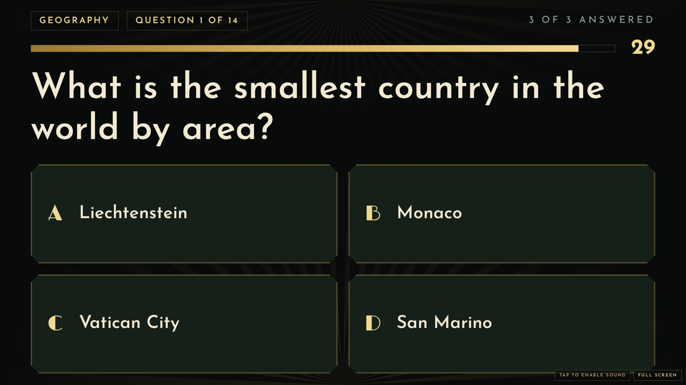
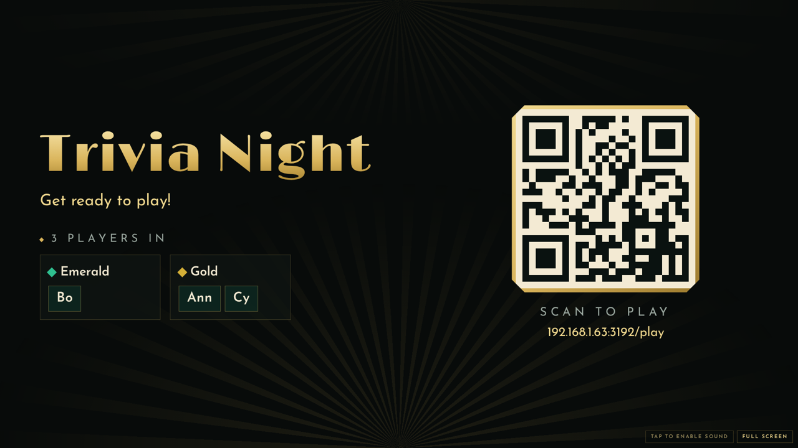
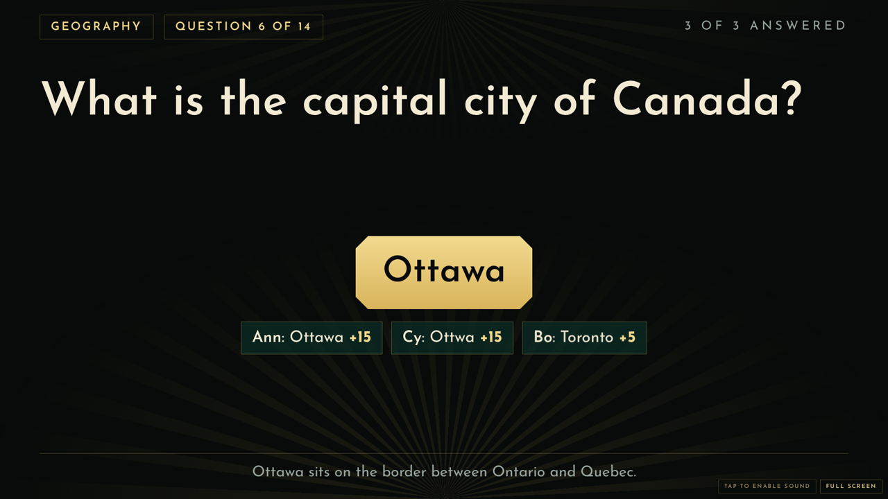
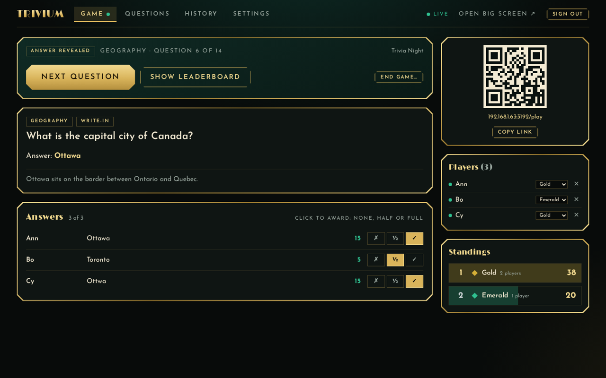
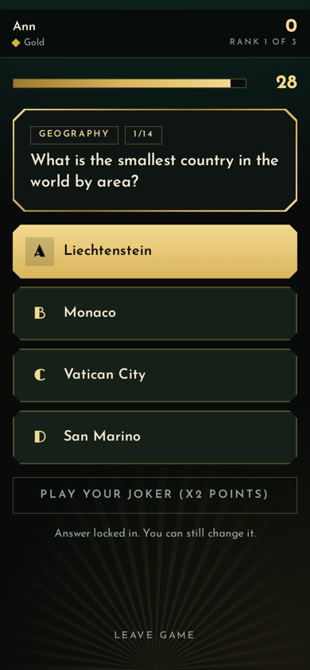
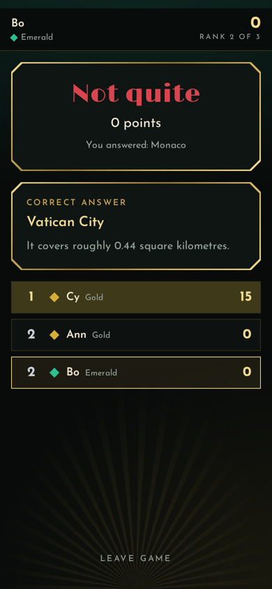

# Trivium

Trivia night for a room full of phones. The host runs the game from a console, a TV or projector shows the questions, and everyone else plays on their own phone.



## Three screens

| Screen | Address | What it is |
| --- | --- | --- |
| **Players** | `/play` | A phone view. Join with a name, tap an answer, play a joker, see your result and rank. |
| **Big screen** | `/screen` | For a TV or projector. Lobby with a join QR code, countdown, answer bars, leaderboards, podium. |
| **Host** | `/host` | Set up a game, run it, grade write-in answers, manage questions, review past games. |

| Lobby | Reveal |
| :-- | :-- |
|  |  |

| Host console | Phone: answering | Phone: result |
| :-- | :-- | :-- |
|  |  |  |

## Features

- **Two question types.** Multiple choice, or write-in. Write-in answers match typos and alternative spellings (`Everest|Mount Everest`), and the host can override any mark with none, half or full credit. Questions can carry an image.
- **Scoring that rewards speed.** Timed questions add up to 50% extra for fast answers. Each player gets one **joker** per game that doubles a question's points.
- **Individuals or teams.** Players choose a team or are balanced automatically. A team's score is the average of its members, so uneven teams stay fair, or you can switch it to the total.
- **Rounds.** One long quiz, rounds of a fixed size, or one round per category, with standings between rounds and a podium at the end.
- **A question bank.** Add, edit and delete questions, filter them, and import or export JSON. A fresh install comes with 38 questions across six categories.
- **History.** Every finished game is saved with its standings, and the History tab lists your hardest and easiest questions from real answers.
- **Sound.** Countdown ticks, a buzzer, a reveal chime and a fanfare, synthesised in the browser. No audio files.
- **Works offline.** Fonts are bundled and there is nothing to fetch from the internet.

### Fair play

The server owns the game. Correct answers stay on the server until the reveal, so looking at network traffic gives nothing away, and players cannot change scores or drive the game. The host console is limited to the host machine until you set a PIN, and requests that arrive through a proxy or tunnel are treated as remote.

## Quick start

Needs **Node.js 24 or newer**. SQLite is built in, so there is nothing to compile.

```bash
git clone https://github.com/sh0tybumbati/trivium.git
cd trivium
npm install
npm run build
npm start
```

The server prints the addresses to use:

```
Trivium is running
  On this machine:  http://localhost:3001
  On your network:  http://192.168.1.20:3001
```

Open `/host` on this machine, start a game, put `/screen` on the TV, and have players scan the QR code.

For development, `npm run dev` starts the server and the Vite dev server together (open the Vite address, usually `http://localhost:5173`).

## Configuration

Set these as environment variables.

| Variable | Default | Purpose |
| --- | --- | --- |
| `PORT` | `3001` | Port to listen on. |
| `HOST` | `0.0.0.0` | Interface to listen on. |
| `TRIVIUM_DB` | `data/trivium.db` | Where the database is stored. |
| `HOST_PIN` | none | PIN for the host console. Overrides any PIN set in the app. |
| `PUBLIC_URL` | none | Public address used in QR codes, for example `https://trivia.example.com`. |
| `REQUIRE_JOIN_CODE` | off | Set to `1` to make players enter the four-letter code from the big screen. |

Running it beyond one room, behind a tunnel or on a server, is covered in [docs/deployment.md](docs/deployment.md).

## Scoring

| Rule | Detail |
| --- | --- |
| Base points | Set per game (default 10). |
| Speed bonus | Up to +50% of the base, in proportion to the time left. Only for a fully correct answer. |
| Half credit | Write-in only. Half the base points, no speed bonus. |
| Joker | Doubles the points for one question. It is used up only if the player answered. A wrong answer with a joker still scores zero. |
| Ties | Share a rank. The next rank is skipped (1, 1, 3). |

## Project layout

```
server/
  index.js     HTTP and WebSocket server, host sign-in, rate limits
  game.js      the game engine: phases, answers, scoring, per-audience views
  scoring.js   pure scoring and answer-matching rules
  db.js        SQLite (node:sqlite): questions, settings, game history
  auth.js      PIN hashing, sessions, local-request detection
  seed.js      starter questions
src/
  screens/     Landing, Player, BigScreen, Host (+ host/ tabs)
  lib/         API client, live-state hook, countdown, sound
  ui/          shared Art Deco components
test/          unit and end-to-end tests
```

## Playtesting on your own

You do not need a room full of people to try a game. `npm run bots` joins fake players to the open lobby, and they answer on their own with realistic delays.

1. `npm start`, open `/host`, and open the lobby.
2. Put `/screen` in another window or on a TV.
3. In a terminal: `npm run bots -- --count 8` (add `--speed 3` to make them quicker, `--code ABCD` if you require a join code).
4. Start the game from the host console. Join from your own phone as well to see what a real player sees.

The bots keep going until the game finishes, then print their final scores.

## Tests

```bash
npm test
```

Covers the scoring rules, the database layer, the whole game flow with a controllable clock (timer, jokers, teams, rounds, grading, history), and the HTTP and WebSocket server end to end, including that answers never leak before the reveal.

## Limits

One game runs at a time, and a live game lives in memory. Restarting the server ends the game in progress, but questions and finished games are kept.
